# Directory Traversal in Detail
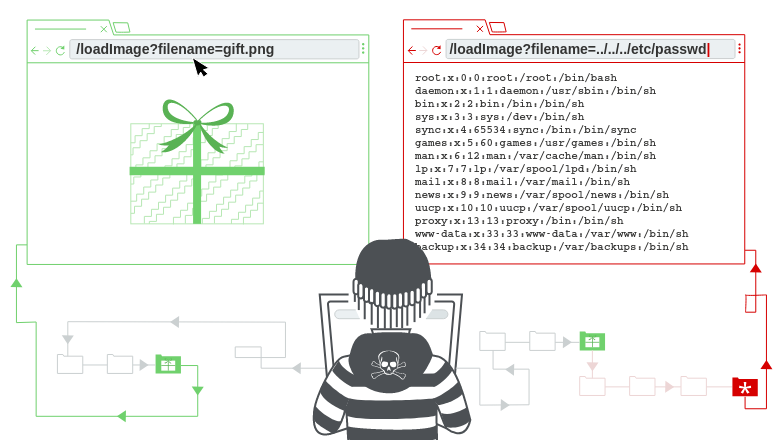
## What is Directory Traversal?
Directory Traversal/Path Traversal is a web app security vulnerability which allows an attacker to read the files available on the system which is running the application. This file can be anything like the application's code and data, user's database, login credentials, sensitive information files, etc. In some cases, the attacker might be able to write arbitrary files on the server allowing modification of any data which can lead to full control of the system.

### Reading Arbitrary Files via Directory Traversal
Suppose a shopping application loads a file from the system/server to display it to us and the filename is passed as a parameter to the application. It work's something like this:
```html

```

The `loadImage` URL takes the name of a file i.e. `filename` as a parameter and displays it to the end user.

Let's suppose that the images for the website are stored at `/var/www/staic/images`. To return an image specified in the URL using the `filename`, the filename is appended to the path. i.e. the path for the image becomes: `/var/www/static/images/guitar.png`

If the application doesn't implement secure code against directory traversal attacks, the attacker can perform the attack to read arbitrary files on the system/server.

Suppose the attacker makes the requests for the URL
```
https://website.com/loadImage?filename=../../../../../etc/passwd
```

This makes the application retrieve the file which is at:
```
/var/www/static/images/../../../../../etc/passwd
```

And if you've worked with directories before, you would understand what the attacker is trying to do using the `../` . And if you're not sure, the `../` is used to go to the parent directory of the current directory. So, when `../` is used multiple times
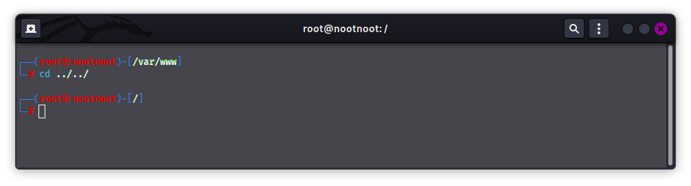
As you can see above. It goes to the parent directory

Loading the file `/var/www/static/images/../../../../../etc/passwd` would result in: 
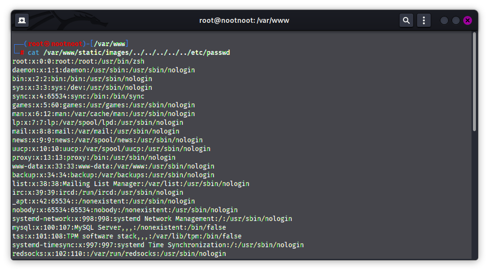

The `../../../../..` takes the system to the root directory. And the `/etc/passwd` file is used to keep track of every registered user that has access to a system. 

The `/etc/passwd` file is a standard file on Unix type systems which stores essential information required during login. In other words, it stores user account information. The `/etc/passwd` is a plain text file. It contains a list of the system’s accounts, giving for each account some useful information like user ID, group ID, home directory, shell, and more.

For directory traversal attacks on windows files, you can try retrieving the `C:/Windows/win.ini` or `C:/Windows/system.ini` file while checking for directory traversal attacks.
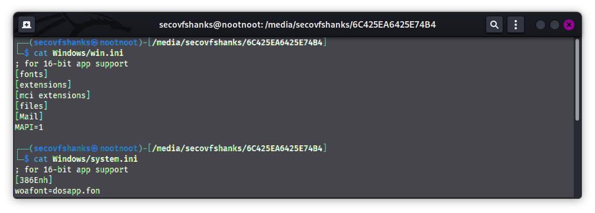
*The above files are from the **Windows Drive***

#### [Directory Traversal Lab 1 - File path traversal, simple case](https://portswigger.net/web-security/file-path-traversal/lab-simple)

Description of Lab:
```
This lab contains a file path traversal vulnerability in the display of product images.

To solve the lab, retrieve the contents of the /etc/passwd file.
```

1. Access the Lab.

2. We will now look for parameters where we can try performing Directory Traversal Attacks.
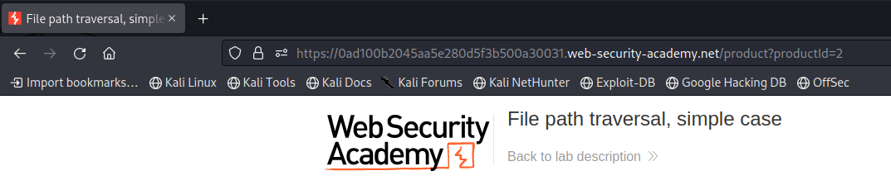
The `productid` parameter.
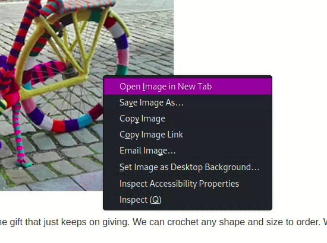
Let's now look at how the file is retrieved.

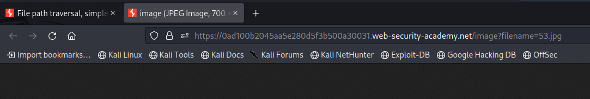

3. Let's now try the first parameter. the `productId`
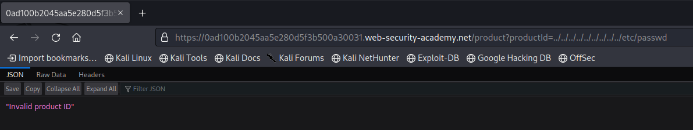

Now let's try the filename parameter.
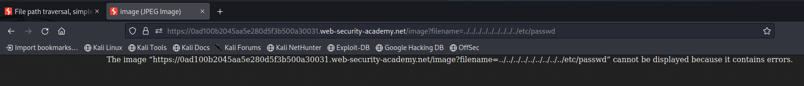

4. And we're done solving the lab.


### Common obstacles to exploit file path traversal vulnerabilities
This section discusses the attacks against common implementation of defence mechanisms against path traversal attacks in file retrieval applications. It acknowledges that despite these defences, there are still ways to bypass them. The paragraph emphasises the importance of practical exercises and lab-solving to explore and understand the techniques used to overcome these defence methods. By gaining insights from these activities, developers can improve the security of file retrieval applications and protect against path traversal attacks. 

#### [Directory Traversal Lab 2 - File path traversal, traversal sequences blocked with absolute path bypass](https://portswigger.net/web-security/file-path-traversal/lab-absolute-path-bypass)

Description of Lab:
```
This lab contains a file path traversal vulnerability in the display of product images.

The application blocks traversal sequences but treats the supplied filename as being relative to a default working directory.

To solve the lab, retrieve the contents of the /etc/passwd file. 
```

1. Access the lab.


2. Right click on the image and open the image in a new tab.


3. Try injecting the URL for exploiting directory traversal.
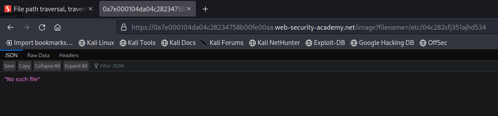
We first try a retrieving a random file just to check the response of the attack. It clearly states: *No such file*

4. Let's now try retrieving the `/etc/passwd` file.

And we can see a result which is different than the previous result. Seeing this we can conclude that we were successful in performing directory traversal attack.

5. And we successfully solved the lab.


In the same lab when we try `./54.jpg`, we don't get an error.


But when we try directory traversal using `../images/54.jpg`, we get the error **No such file**.
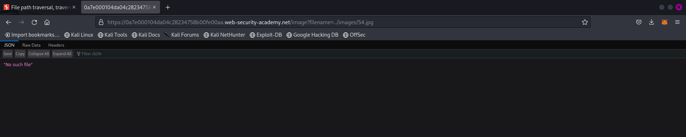

By this we can conclude that either the directory name isn't images or the application is programmed such that when it gets a `../` sequence, it will throw an error.


#### [Directory Traversal Lab 3 - File path traversal, traversal sequences stripped non-recursively](https://portswigger.net/web-security/file-path-traversal/lab-sequences-stripped-non-recursively)

Description of Lab:
```
This lab contains a file path traversal vulnerability in the display of product images.

The application strips path traversal sequences from the user-supplied filename before using it.

To solve the lab, retrieve the contents of the /etc/passwd file. 
```

1. Access the lab.


2. Let's again open one of the images in a new tab.


3. Let's now try the previous directory traversal methods.

The first one didn't work.

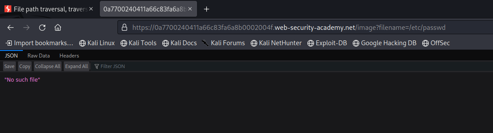
The second one didn't work too. So, we need to try something new.

4. The payload we tried is `....//....//....//....//....//....//etc/passwd` and we are successful.


5. We successfully solved the lab.


**Now let's try to figure out what's happening in the back-end.**


The payload `../../8.jpg` didn't work. This means that either we weren't able to go to the parent directory or the image is in the root directory which most probably isn't the case.

So, it might be that the actual parameter that loaded the image somehow became `8.jpg` or `././8.jpg`. In the first case, the application must be programmed as `replace('../','')` to remove the going to parent directory action. And in the second case, the program might be programmed as `replace('../','./')` to change the parent directory to the current directory. Which is the reason why the image still loads.

Here the payload `.../../8.jpg` caused an error successfully. This means that either one of the two happened and the effective filename became either `.8.jpg` or `.././8.jpg`. In both cases, file wont be found as there doesn't exit a file `.8.jpg` in the current directory and `8.jpg` in the parent directory. 
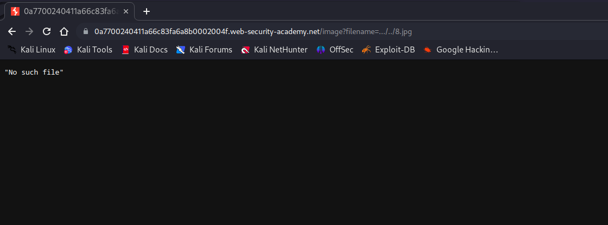

So, this explains why our payload `....//....//....//....//....//....//etc/passwd` worked. It must've translated to an effective filename which is either `../../../../../../etc/passwd`. As the other effective filename i.e. : `...//...//...//...//...//...//etc/passwd` isn't valid.


#### [Directory Traversal Lab 4 - File path traversal, traversal sequences stripped with superfluous URL-decode](https://portswigger.net/web-security/file-path-traversal/lab-superfluous-url-decode)

Description of Lab:
```
This lab contains a file path traversal vulnerability in the display of product images.

The application blocks input containing path traversal sequences. It then performs a URL-decode of the input before using it.

To solve the lab, retrieve the contents of the /etc/passwd file.
```

1. Access the lab.


2. Open any image in a new tab.
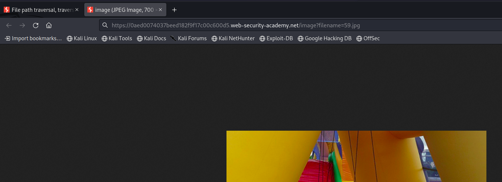

3. Let's try our basic directory traversal attack.
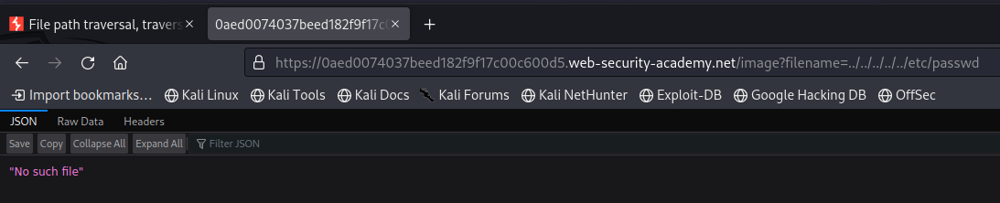
It didn't work.

4. Let's now try encoding the payload for bypassing the sanitization technique.
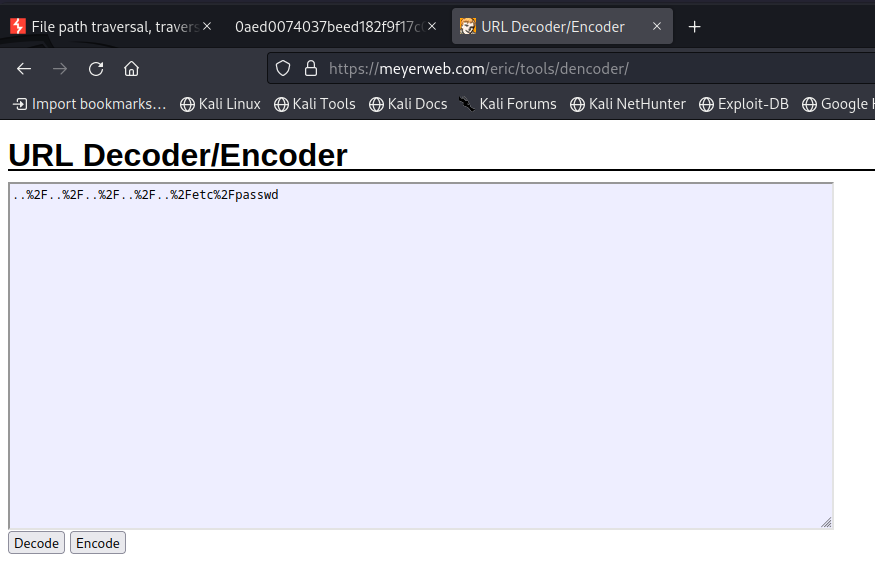
Here's the URL encoded payload.

5. The payload didn't work.
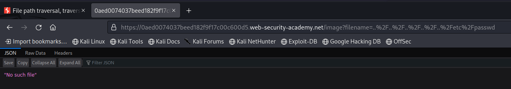

6. Now let's again URL encode the payload.
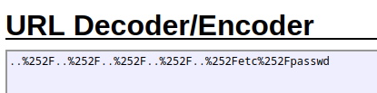
Now the % will be converted to \%25

7.  Here we can see that we didn't get a `No such file` error, This means that we were successful in performing directory traversal attack.
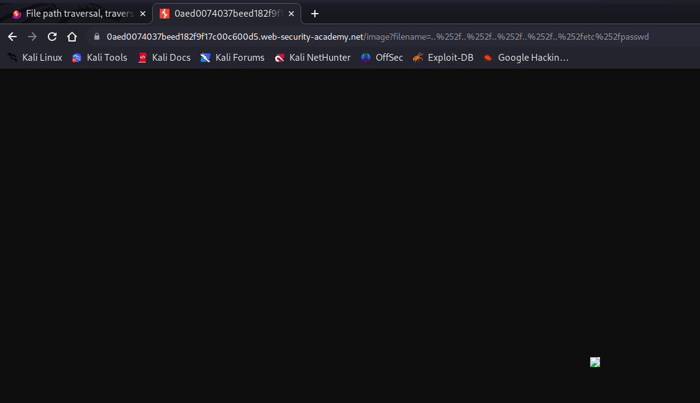

8. And we're done solving the lab.


#### [Directory Traversal Lab 5 - File path traversal, validation of start of path](https://portswigger.net/web-security/file-path-traversal/lab-validate-start-of-path)

Description of Lab:
```
This lab contains a file path traversal vulnerability in the display of product images.

The application transmits the full file path via a request parameter, and validates that the supplied path starts with the expected folder.

To solve the lab, retrieve the contents of the /etc/passwd file.
```

1. Access the lab.


2. Open the Image in a new tab and let's look at the URL.
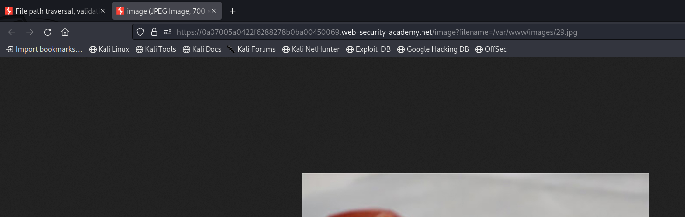
We can see that the URL starts with `/var/www/images`, We can try appending `/../../../etc/passwd` in front of the `images` part of the URL.

3. It worked. We were successful in performing a Directory Traversal attack.
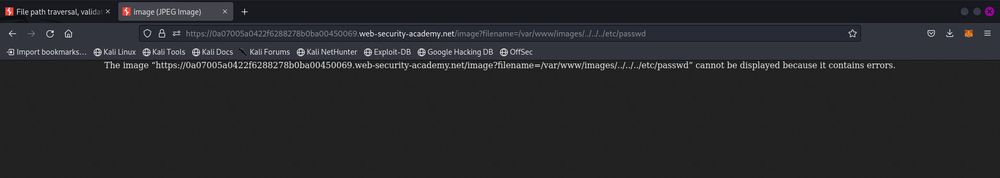

4. And now we're done with the lab.
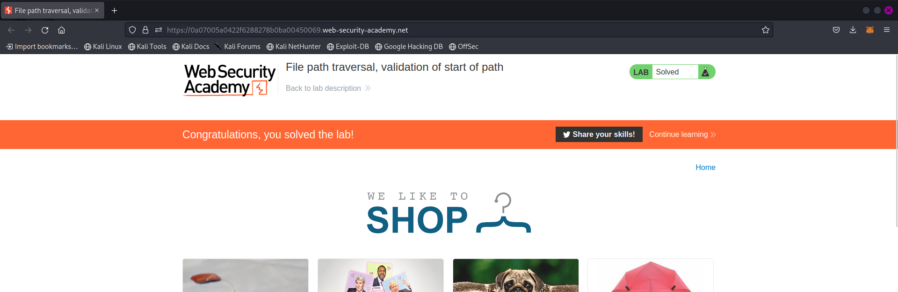


#### [Directory Traversal Lab 6 - File path traversal, validation of file extension with null byte bypass](https://portswigger.net/web-security/file-path-traversal/lab-validate-file-extension-null-byte-bypass)

Description of Lab:
```
This lab contains a file path traversal vulnerability in the display of product images.

The application validates that the supplied filename ends with the expected file extension.

To solve the lab, retrieve the contents of the /etc/passwd file. 
```

1. Access the lab. 
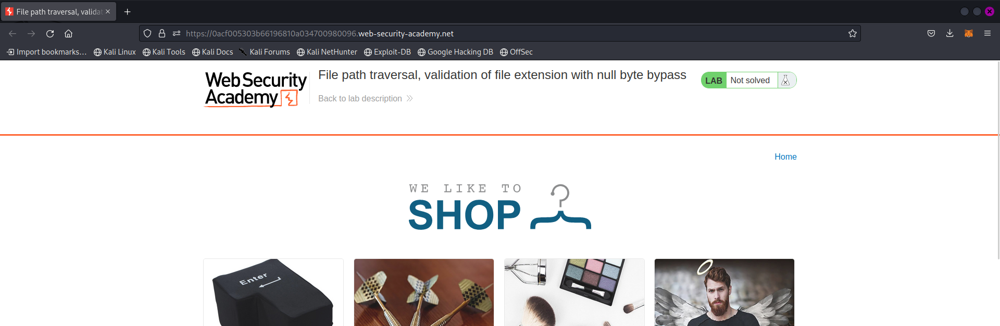

2. Open any image from the webpage in a new tab.
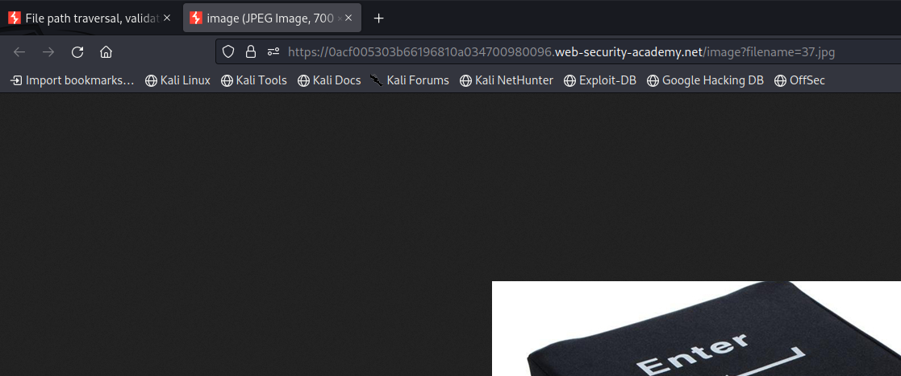
Let's now try appending null character and file extension to the URL.

3. And we here don't get a `No such file` error. That means we were successful performing Directory Traversal attack.
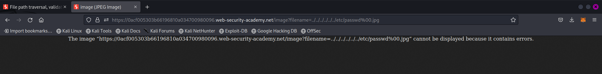

4. And we've solved all the directory traversal labs.


### Summary
```
The text provides a detailed explanation of directory traversal, which is a web application security vulnerability that enables attackers to access and read files on the server. It starts by describing the nature of directory traversal, noting that it allows unauthorized users to retrieve various types of sensitive files, including application code, user databases, login credentials, and other confidential information.

The text then presents a practical example to illustrate how directory traversal attacks can occur. It describes a scenario where a shopping application retrieves and displays images based on a user-supplied filename parameter. By manipulating this parameter, an attacker can inject directory traversal sequences and traverse the file system to access unauthorized files. The example demonstrates how the attacker crafts a request by appending "../" sequences to reach higher-level directories and ultimately retrieve the "/etc/passwd" file, which contains user account information.

Furthermore, the text discusses the specific vulnerabilities associated with directory traversal attacks on both Unix-based and Windows systems. It mentions the retrieval of sensitive files like "C:/Windows/win.ini" and "C:/Windows/system.ini" on Windows, highlighting the importance of considering platform-specific vulnerabilities in securing file retrieval applications.

The text also includes a series of lab scenarios that allow readers to explore different defenses against directory traversal attacks. Each lab presents a specific challenge where the application implements a defense mechanism to mitigate directory traversal vulnerabilities. However, the labs also demonstrate various techniques to bypass these defenses and successfully retrieve the "/etc/passwd" file.

The labs cover different scenarios, including cases where traversal sequences are blocked, where traversal sequences are stripped non-recursively, where traversal sequences are stripped with superfluous URL decoding, where the start of the path is validated, and where file extension validation is employed. By solving these labs, readers can gain hands-on experience and insight into the vulnerabilities and countermeasures associated with directory traversal attacks.

Overall, the text provides a comprehensive overview of directory traversal vulnerabilities, explains how attackers can exploit them, and offers practical exercises to understand and overcome defense mechanisms. It highlights the importance of testing and securing file retrieval applications to prevent unauthorized access to sensitive files on the server.
```

