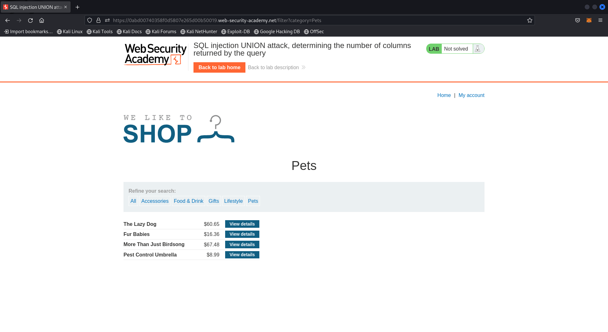
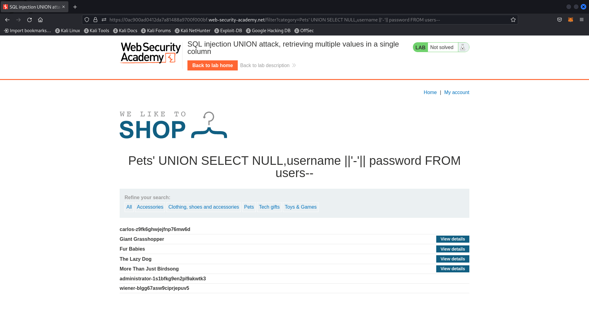
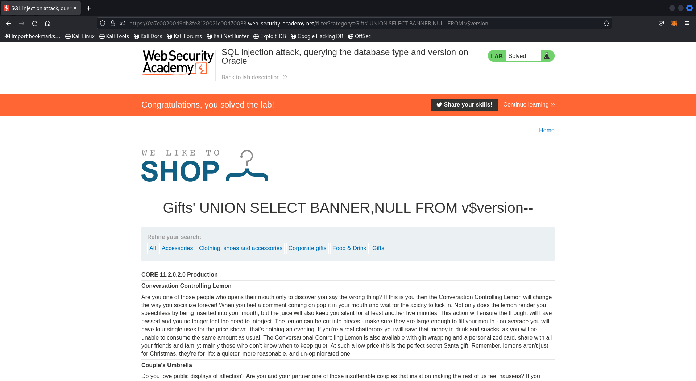
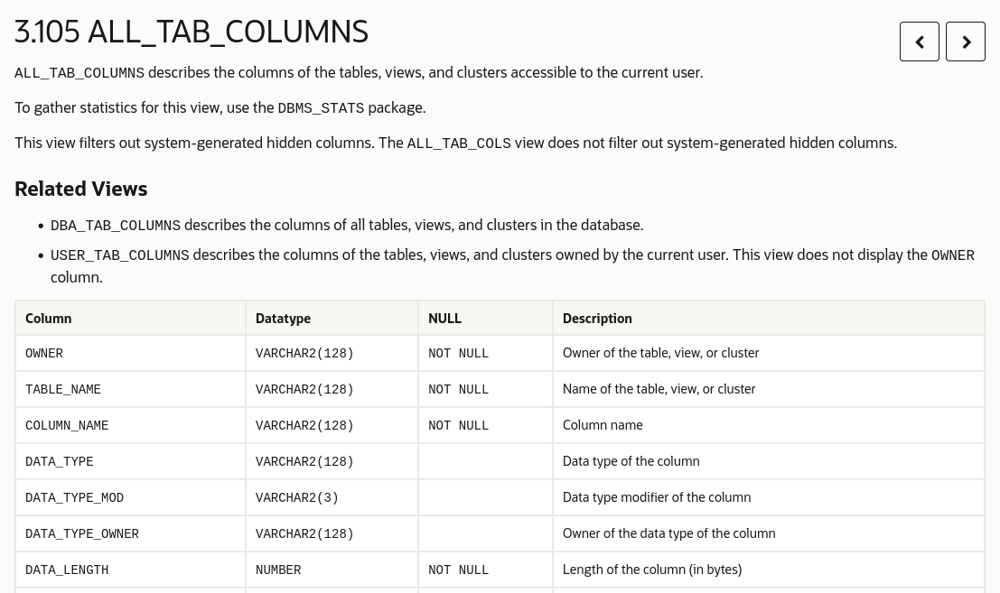
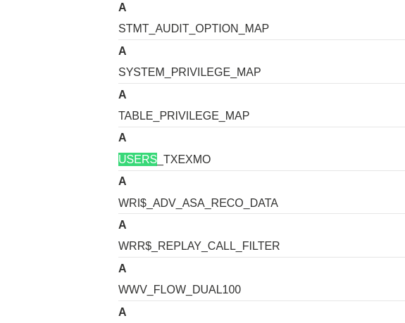
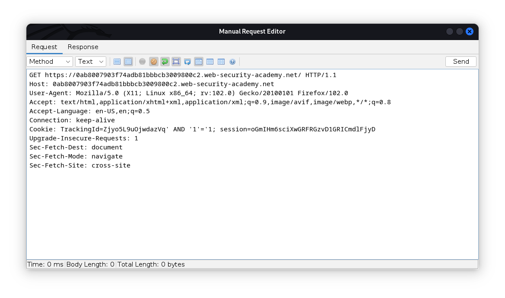
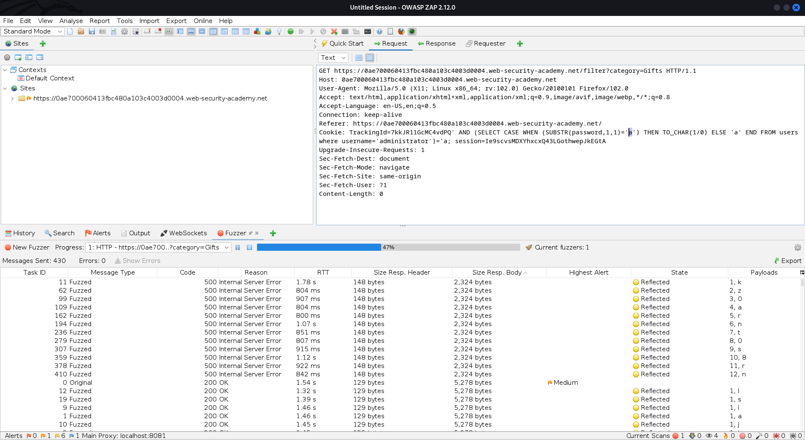
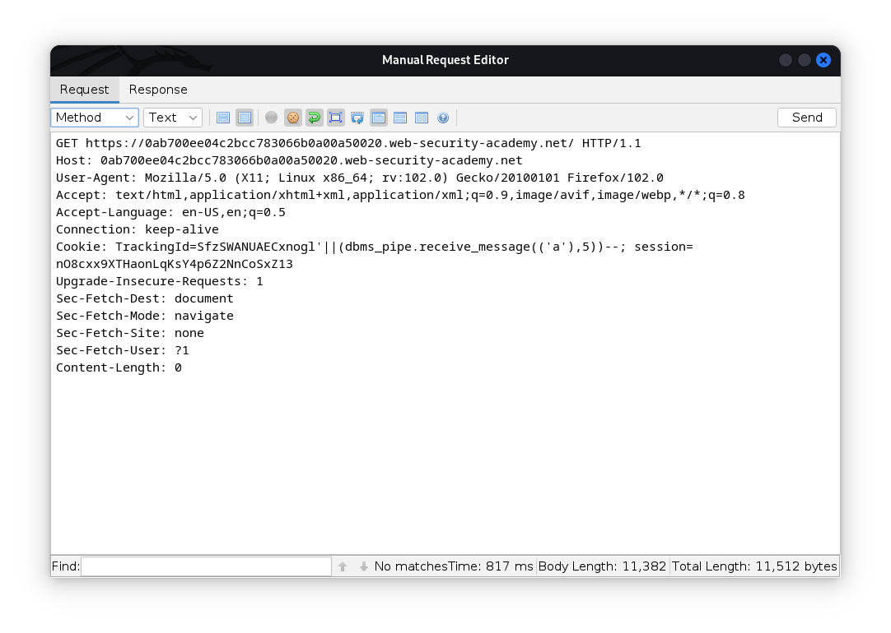

# SQL Injection in Detail


## What Is An SQL Injection(SQLi) Attack?
SQL injection, AKA(Also Known As) SQLi is an injection attack where the attacker can interfere with the underlying queries used in the application for retrieving, modifying, or deleting data. This is possible by modifying the data sent to servers through different parameters. We can try tampering the data sent through HTTP requests for testing for possible SQL Injection vulnerabilities. We will use a web proxy(Burp or ZAP) or maybe the command line for this purpose.

## Impact of a successful SQL Injection
A successful SQLi can result in a lot of damage to a company, reputational and financial. It can be used to retrieve, modify, delete sensitive data which can be user's data containing name, banking information like credit card numbers, DOB, etc. In some cases an attacker can escalate SQLi to more critical vulnerabilities like RCE(Remote Code Execution) and obtain a persistent backdoor into an organisation's systems.


### We'll Now Look At Some SQLi Examples:
- Retrieving Hidden Data: Where the modified SQL query can return additional results
- Subverting Application Logic: Where the modified SQL query can interfere with the logic of the application, Like bypassing the login authentication.
- UNION attacks: Where the modified SQL query can retrieve data from other tables.
- Examining the database: Where the modified SQL query can extract information about the database used and the structure of the database. 
- Blind SQL Injection: Where the modified SQL query's results are not displayed in the application's response.

Here's The Link To [Cheat Sheet](https://portswigger.net/web-security/sql-injection/cheat-sheet)


## Let's now solve the labs provided by PortSwigger

### Retrieving Hidden Data
Suppose a commercial website with unreleased product/user's data and passwords that the website doesn't want you to see for obvious reasons. An SQL Injection attack when performed successfully can help retrieve such data if parameter(s) are not programmed properly. We will now look at such examples from the PortSwigger's [Web Security Academy's Labs](https://portswigger.net/web-security)

#### [SQL Injection Lab 1 - SQL injection vulnerability in WHERE clause allowing retrieval of hidden data](https://portswigger.net/web-security/sql-injection/lab-retrieve-hidden-data)
Description of Lab:
```
This lab contains a SQL injection vulnerability in the product category filter. When the user selects a category, the application carries out a SQL query like the following:
 
SELECT * FROM products WHERE category = 'Gifts' AND released = 1

To solve the lab, perform a SQL injection attack that causes the application to display one or more unreleased products.
```

1. This is the homepage of the shopping website which we need to perform an SQL injection on to retrieve the *Hidden Data*


2. After selecting the Gifts category, We can see the URL changed and we can conclude that the category parameter is parsed through URL.


What the back-end query might look like:
```SQL
SELECT * FROM  products WHERE category = 'Gifts' AND released = 1
```

3. 

Let's try injecting the payload:
```SQL
' OR 1=1--
```

This payload will change the query to:
```SQL
SELECT * FROM  products WHERE category = 'Gifts' OR 1=1--' AND released = 1
```

Notice how the Query after the -- is commented and the database server is made to select all the data where either the category is Gifts or when 1=1, Which is true in all cases.

4. And the lab is solved.


### Subverting Application Logic
Just like we commented the released part of the query in the last lab, We can similarly bypass the password check of login pages if not programmed properly.

#### [SQL Injection Lab 2 - SQL injection vulnerability allowing login bypass](https://portswigger.net/web-security/sql-injection/lab-login-bypass)

Description of Lab:
```
This lab contains a SQL injection vulnerability in the login function.

To solve the lab, perform a SQL injection attack that logs in to the application as the `administrator` user.
```

1. Let's visit the login page now and try attacking the page using SQL Injection attacks.


2. Let's now inject the application using the username parameter. 

*Note: We Don't Use Password For Injection Attacks As The Password Is Hashed Before Comparing It To The Values In The Users Table.*

What the back-end query might look like:
```SQL
SELECT cookies,someOtherData FROM users WHERE username = '______' AND password = '______'
```

3. We'll now inject the username parameter with the payload `administrator'--`.


This payload will change the query to:
```SQL
SELECT cookies FROM users WHERE username = 'administrator'-- AND password = 'PasswordEntered'
```

The password will be commented and it will bypass the login.

4. And we're in as Administrator.


### UNION Attacks(Retrieving Data From Other Database Tables)
UNION attacks are where we can retrieve additional information which may be from some other table. The only important thing we need to note here is the data we union with other data should be of same data type and there are some columns which can not be null.

#### [SQL Injection Lab 3 - SQL injection UNION attack, determining the number of columns returned by the query](https://portswigger.net/web-security/sql-injection/union-attacks/lab-determine-number-of-columns)

Description of Lab:
```
This lab contains a SQL injection vulnerability in the product category filter. The results from the query are returned in the application's response, so you can use a UNION attack to retrieve data from other tables. The first step of such an attack is to determine the number of columns that are being returned by the query. You will then use this technique in subsequent labs to construct the full attack.

To solve the lab, determine the number of columns returned by the query by performing a SQL injection UNION attack that returns an additional row containing null values.
```

1. Let's Access the lab.


2. Here after selecting the pets category, We can see the change in URL. We will now try SQL injection payloads for solving the lab.


There are 2 ways which can help in determining the number of columns in the result. One is by trying to order the columns using the `ORDER BY` keyword and the other one is by trying to `UNION` extra rows to the result query. We need to know the number of columns in the result query to successfully `UNION` extra rows of data.

3. Let's now try ordering the result of query by each column. Injecting the payload `' ORDER BY 1--`.


4. Let's now try `' ORDER BY 2--` 


5. Let's now try `' ORDER BY 3--`. 


6. When we try the `' ORDER BY 4--` payload, it gives an error. By this we can colclude the result of the query has 3 columns.


7. Let's now add an additional column of data by UNION-ing an additional row with NULL data.


And the lab is solved.

#### [SQL Injection Lab 4 - SQL injection UNION attack, finding a column containing text](https://portswigger.net/web-security/sql-injection/union-attacks/lab-find-column-containing-text)

Description of Lab:
```
This lab contains a SQL injection vulnerability in the product category filter. The results from the query are returned in the application's response, so you can use a UNION attack to retrieve data from other tables. To construct such an attack, you first need to determine the number of columns returned by the query. You can do this using a technique you learned in a previous lab. The next step is to identify a column that is compatible with string data.

The lab will provide a random value that you need to make appear within the query results. To solve the lab, perform a SQL injection UNION attack that returns an additional row containing the value provided. This technique helps you determine which columns are compatible with string data. 
```

As we now know how find the number of columns, our main task here is to find the column with the data-type which can contain strings. i.e. CHAR or VARCHAR type. 

1. Let's now access the lab and try finding the number of columns.


2. `' ORDER BY 3--` didn't result in an error. Which means there are 3 or more columns. Which we can guess by the number of data returned for a product.
 


3. The `' ORDER BY 4--` did generate an error. This means that the number of columns is 3.


4. Now we will try injecting the string `a` in the payload for finding the column which can contain text. 


5. After a bit of playing around, I found that the second column, Logically, this must be the product name.


6. Let's now make the website reflect the given text to solve the lab.

And we're done.

#### [SQL Injection Lab 5 - SQL injection UNION attack, retrieving data from other tables](https://portswigger.net/web-security/sql-injection/union-attacks/lab-retrieve-data-from-other-tables)

Description of Lab:
```
This lab contains a SQL injection vulnerability in the product category filter. The results from the query are returned in the application's response, so you can use a UNION attack to retrieve data from other tables. To construct such an attack, you need to combine some of the techniques you learned in previous labs.

The database contains a different table called users, with columns called username and password.

To solve the lab, perform a SQL injection UNION attack that retrieves all usernames and passwords, and use the information to log in as the administrator user. 
```

1. Let's now find the number of columns.


2. By using the `ORDER BY` keyword, We find the number of columns returned by the query. That is 2 columns. We will now try retrieving the username and password of the administrator to log in.


3. Using the UNION statement, We are successfully able to retrieve data from the users table.


4. Let's now use the administrator username and password to log in.


5. And we're done.


#### [SQL Injection Lab 6 - SQL injection UNION attack, retrieving multiple values in a single column](https://portswigger.net/web-security/sql-injection/union-attacks/lab-retrieve-multiple-values-in-single-column)

Description of Lab:
```
This lab contains a SQL injection vulnerability in the product category filter. The results from the query are returned in the application's response so you can use a UNION attack to retrieve data from other tables.

The database contains a different table called users, with columns called username and password.

To solve the lab, perform a SQL injection UNION attack that retrieves all usernames and passwords, and use the information to log in as the administrator user. 
```

We might need to retrieve multiple values in a single column due to the data type of the columns. This is when we try concatenating string/values from different columns to a single column.

1. Access the lab.


2. Get the number of columns by using the `ORDER BY` keyword as done before.


3. Now we know that the number of columns are 2.
   


4. Let's now try retrieving the username and password in a column and for this purpose, we will try the crafted payload which is: `' UNION SELECT NULL,username||'-'||password FROM users--`.


We can now see the usernames and passwords Listed in the product name column.

5. Get the administrator password and log in.


6. And we're done solving the lab


### Examining the Database
Examining the database is about getting information about the database used. In these type of vulnerabilities, we can use some predefined tables to gather sensitive information about the database and everything available in the database.

#### [SQL Injection Lab 7 - SQL injection attack, querying the database type and version on Oracle](https://portswigger.net/web-security/sql-injection/examining-the-database/lab-querying-database-version-oracle)

Description of Lab:
```
This lab contains a SQL injection vulnerability in the product category filter. You can use a UNION attack to retrieve the results from an injected query.

To solve the lab, display the database version string.
```

1. Find the number of columns using the `ORDER BY` keyword. 


fuzzer2. From the above, we can conclude that the result of the query gives 2 columns. And now we will try adding text to the displayed result. 


3. Let's now try different payloads from the cheat-sheet.


4. From trial and error, we find that the database system used is by Oracle. So, we will now do some research of our own to think of how we can retrieve the Database Version Information.


5. Let's now craft and use the payload for retrieving information about the database. `' UNION SELECT BANNER,NULL FROM v$version`.


And the lab is now solved.

To get the version and other information in a more readable way, Let's Inject a heading named '- Lab Solved' so that the results appear at the top.


#### [SQL Injection Lab 8 - SQL injection attack, querying the database type and version on MySQL and Microsoft](https://portswigger.net/web-security/sql-injection/examining-the-database/lab-querying-database-version-mysql-microsoft)

Description of Lab:
```
This lab contains a SQL injection vulnerability in the product category filter. You can use a UNION attack to retrieve the results from an injected query.

To solve the lab, display the database version string.
```

1. Access the lab first.


2. Let's now try injecting SQL to perform injection attack. Payload: `' UNION SELECT 'A','B'--`


3. Let's give it another try using other payload. Payload: `' UNION SELECT 'A','B'#`


4. Again let's give it another try using other payload. Payload: `' UNION SELECT NULL,NULL#`

Give it another try using other payload. Payload: `' UNION SELECT NULL,NULL--`


5. Now that we're getting server error with each payload, let's check the cheat-sheet for some ideas. 

Here we find that there's explicitly mentioned *\[Note the space after the double dash\]*

6. Let's try the new payload. Payload: `' UNION SELECT 'A','B'-- #`

This worked because of the character  after the space after the double dash, As mentioned in the cheat-sheet.

7. Congratulations, We *Exploited* The Lab Successfully.


#### [SQL Injection Lab 9 - SQL injection attack, listing the database contents on non-Oracle databases](https://portswigger.net/web-security/sql-injection/examining-the-database/lab-listing-database-contents-non-oracle)

Description of Lab:
```
This lab contains a SQL injection vulnerability in the product category filter. The results from the query are returned in the application's response so you can use a UNION attack to retrieve data from other tables.

The application has a login function, and the database contains a table that holds usernames and passwords. You need to determine the name of this table and the columns it contains, then retrieve the contents of the table to obtain the username and password of all users.

To solve the lab, log in as the administrator user.
```

1. Let's just get into finding the number of columns. Payload: `' ORDER BY 3--`. This gives an error.


2. The payload `' ORDER BY 2--` doesn't give an error. This concludes that the number of columns is 2.


3. Let's now try adding another row of data to the result of the query using the `UNION` keyword.

We now know that we can `UNION` data to the result of query.

4. Now, we will try some payloads for examining the database. From the cheatsheet, we know that non-Oracle databases have a database named information_schema which has a table named tables which contains information about all the tables. Payload: `' UNION SELECT *,NULL FROM information_schema.tables`

Using the SQL Prompt, We can get information about the database's internals.
Commands:
`USE INFORMATION_SCHEMA;`
`SHOW TABLES;`


Now the commands we will use for further investigation are:
`SELECT * FROM TABLES LIMIT 20;`
`SELECT TABLE_NAME FROM TABLES LIMIT 20;`
*Note: The `LIMIT 20` is used to retrieve only the first 20 rows of data as the number of data in the table are around 300*


5. Now to retrieve the table names, We will use the payload `' UNION SELECT TABLE_NAME,NULL FROM INFORMATION_SCHEMA.TABLES`


6. Let's now `Ctrl + f` for finding the table of users.


Let's now look at the columns table from information_schema.


This is how we can retrieve the table_name and column_name.
Command: `SELECT TABLE_NAME,COLUMN_NAME FROM information_schema.columns WHERE [CONDITION]`


7. Now that we know the users table name, Let's now try retrieving the column name from information_schema database.


And now we have the column names from the users table. By looking at the results, we can find the username and password column names.


9. We can now use the payload(will be different while you're solving the lab) 
   `' UNION SELECT username_bxvcjr,password_jjlshn FROM users_wnxdyb--`


And we're successfully able to retrieve the usernames and passwords.

11. Log in as the administrator, And we're done.


#### [SQL Injection Lab 10 - SQL injection attack, listing the database contents on Oracle](https://portswigger.net/web-security/sql-injection/examining-the-database/lab-listing-database-contents-oracle)

Description of Lab:
```
This lab contains a SQL injection vulnerability in the product category filter. The results from the query are returned in the application's response so you can use a UNION attack to retrieve data from other tables.

The application has a login function, and the database contains a table that holds usernames and passwords. You need to determine the name of this table and the columns it contains, then retrieve the contents of the table to obtain the username and password of all users.

To solve the lab, log in as the administrator user. 
```

  1. We know that the database used is by oracle. So, we will first try basic UNION injection attack using the payload `' UNION SELECT 'A','a' FROM dual--`

This works, As we already tried retrieving the table and column names from the database. We have an idea of how it works. Let's do our research to find how it is done on Oracle Databases.

2. This is the information I found in the online documentation of Oracle databases.



3. Let's now retrieve the table names using the payload 
   `' UNION SELECT 'A',TABLE_NAME FROM ALL_TABLES--`


4. Let's now find the users table.


5. Let's now retrieve the column names using the payload
   `' UNION SELECT 'A',COLUMN_NAME FROM ALL_TAB_COLUMNS WHERE TABLE_NAME='USERS_TXEXMO'`


6. Now that we know the username and password column's name, Let's retrieve the usernames and password. Payload: `' UNION SELECT USERNAME_MCTKCL,PASSWORD_HUXNXI FROM USERS_TXEXMO`


7. Now log in as the administrator.


### Blind SQL injection vulnerabilities
Blind SQL injection vulnerabilities are when the results of the query aren't visible to the end user. We use some other techniques like analysing response with conditional responses, invoking conditional errors, inducing time delays, using time delays for information retrieval, etc. for exploiting blind SQL injection vulnerabilities.

#### [SQL Injection Lab 11 - Blind SQL injection with conditional responses](https://portswigger.net/web-security/sql-injection/blind/lab-conditional-responses)
Description of Lab:
```
This lab contains a blind SQL injection vulnerability. The application uses a tracking cookie for analytics, and performs a SQL query containing the value of the submitted cookie.

The results of the SQL query are not returned, and no error messages are displayed. But the application includes a "Welcome back" message in the page if the query returns any rows.

The database contains a different table called users, with columns called username and password. You need to exploit the blind SQL injection vulnerability to find out the password of the administrator user.

To solve the lab, log in as the administrator user. 
```

1. To solve this lab, we will have to edit the HTTP request to perform SQL injection. For this purpose, I'm going to use OWASP's Zed Attack Proxy(ZAP).

Click on manual explore and launch browser.

Now copy paste the link in the browser to see the HTTPS requests being used.

Follow the above steps to get started.

2. We can now here see the history of requests made. 

To see the request contents, change to request tab as shown below.


3. Now right click on the request and click on the "Open/Resent with Request Editor..." option.


4. This will open a new tab which will let us change the request in a way we want. Now we will inject the trackingId parameter. with a conditional statement. Payload: `trackingId='x' AND '1'='1`

This responds with a "Welcome back!" message. Which means it identifies the trackingId AND 1 does equal to 1.


5. Now let's try doing the same with the payload `trackingId='x' AND '1'='2`

And we have a response with no "Welcome back!" message.


6. Let's now try the SUBSTRING function for retrieving data. Edit the request to make it: `' AND SUBSTRING((SELECT password FROM users WHERE username='administrator'), 1, 1)='a`. If the condition is true, We must get a "Welcome back!" message. And we don't know if the payload would work correctly, we will first just try for the first character of the password's phrase.

Select the `a` from payload and then right click on the request and fuzz. Fuzzing means brute-forcing. i.e. trying all different combinations. And from the hint, we know that the password contains only \[a-z]\[0-9]. So, Let's now fuzz all the characters.

Select Payloads.


Select Add.


Select Type: Strings. and put \[a-z]\[0-9] in contents.


And now start the fuzzer.

7. And well now see the fuzzed requests in the fuzzer tab.


8. Looking at them closely, we can conclude that we are getting a request that stands out from other requests. This means that our payload works.


9. Now we will select different positions of password strings for comparing it with different characters.

Also, if you're thinking how will we know the password's length to know how much to fuzz. You're on the right path. There's a way. Think about it. I have it covered in the Miscellaneous section of the next lab's walkthrough.

10. This will give us all the fuzzed requests.


11. We have our password built up now and we are now free to log in using the password.


12. Log in as the administrator.


13. And we're done with the lab.


#### [SQL Injection Lab 12 - Blind SQL injection with conditional errors](https://portswigger.net/web-security/sql-injection/blind/lab-conditional-errors)

Description of Lab:
```
This lab contains a blind SQL injection vulnerability. The application uses a tracking cookie for analytics, and performs a SQL query containing the value of the submitted cookie.

The results of the SQL query are not returned, and the application does not respond any differently based on whether the query returns any rows. If the SQL query causes an error, then the application returns a custom error message.

The database contains a different table called users, with columns called username and password. You need to exploit the blind SQL injection vulnerability to find out the password of the administrator user.

To solve the lab, log in as the administrator user.
```

Here we're jumping straight to manually editing the request. If you are not sure how to do so, Follow the first four steps of previous lab.

1. Let's now try make a query such that the it produces an error when `TRUE` and doesn't give an error when we use `FALSE`. For producing `TRUE`, we will use (1=1) And for `FALSE`, we will use (1=2). Payload: `' AND (SELECT CASE WHEN (1=2) THEN TO_CHAR(1/0) ELSE 'a' END FROM dual)='a`


We didn't get an error using `FALSE` condition. Now let's try the same for a `TRUE` condition.

2. Payload: `' AND (SELECT CASE WHEN (1=1) THEN TO_CHAR(1/0) ELSE 'a' END FROM dual)='a`


We successfully raised an error which resulted in **Internal Server Error**. Let's now use this to our advantage and try to retrieve the password for administrator.

3. Let's now make a payload for retrieving the administrator's password using the conditional errors. Payload: `' AND (SELECT CASE WHEN (SUBSTR(password, 1, 1)='a') THEN TO_CHAR(1/0) ELSE 'a' END FROM users WHERE username='administrator')='a`


The payload didn't raise an error, this means that the first letter may not be `a`. Let's now try to fuzz the a with all the possible characters, i.e. \[a-z]\[0-9]. 

4. Use the fuzzer to try all the characters like we did in the last lab. 



And we can see the Internal Server Errors coming up for different position of characters in the password string.

5. Now log in as the administrator and we're done.


Miscellaneous: How to retrieve password length.

1. As we know here we can raise errors using conditional statements. We will now use this for retrieving password length. Let's now generate a payload to raise an error when the password length matches. Payload: `' AND (SELECT CASE WHEN (LENGTH(password)=1) THEN TO_CHAR(1/0) ELSE 'a' END FROM users WHERE username='administrator')='a`


3. Now we will fuzz the password length value to raise an error for the correct password length.


4. Here we can see a request whose response stands out from other requests. Which is an Internal Server Error. So we now know that the password length is 20.


#### [SQL Injection Lab 13 - Blind SQL injection with time delays](https://portswigger.net/web-security/sql-injection/blind/lab-time-delays) 

Description of Lab:
```
This lab contains a blind SQL injection vulnerability. The application uses a tracking cookie for analytics, and performs a SQL query containing the value of the submitted cookie.

The results of the SQL query are not returned, and the application does not respond any differently based on whether the query returns any rows or causes an error. However, since the query is executed synchronously, it is possible to trigger conditional time delays to infer information.

To solve the lab, exploit the SQL injection vulnerability to cause a 10 second delay. 
```

1. As we know from the description of the lab that we need to cause a 10 second delay to solve the lab. We will go straight to the cheat-sheet to see how time delays work.


2. Here are the respective ways to concatenate 2 results of different database. As we are not sure which database is being used, we will try all the different payloads.


3. Trying Oracle. Payload: `'||(dbms_pipe.receive_message(('a'),10))--`


Didn't work.

4. Moving on, trying Microsoft database. Payload: `'+(WAITFOR DELAT '0:00:10')--`


Didn't work.

5. Trying PostgreSQL. Payload: `'||(SELECT pg_sleep(10))--` 


And Yes, We can see a 10 second delay in response time. We successfully caused a 10 second delay.

6. And the lab is solved.


#### [SQL Injection Lab 14 - Blind SQL injection with time delays and information retrieval](https://portswigger.net/web-security/sql-injection/blind/lab-time-delays-info-retrieval)

Description of Lab:
```
This lab contains a blind SQL injection vulnerability. The application uses a tracking cookie for analytics, and performs a SQL query containing the value of the submitted cookie.

The results of the SQL query are not returned, and the application does not respond any differently based on whether the query returns any rows or causes an error. However, since the query is executed synchronously, it is possible to trigger conditional time delays to infer information.

The database contains a different table called users, with columns called username and password. You need to exploit the blind SQL injection vulnerability to find out the password of the administrator user.

To solve the lab, log in as the administrator user. 
```

1. Now that we know how to cause a time delay. Let's first find the database being used. Oracle First. Payload: `'||(dbms_pipe.receive_message(('a'),5))--`

Didn't Work. Moving on. 

2. Microsoft now. Payload: `'+(WAITFOR DELAY '0:00:10')--`

Didn't Work. Moving on. 

3. PostgreSQL Now. Payload: `'||(select pg_sleep(10))--` 

Worked! Now we know that we're working with PostgreSQL Database. Let's craft payload for this database.


4. Payload: `'||(SELECT CASE WHEN (SUBSTRING(password,1,1)='a') THEN pg_sleep(3) ELSE pg_sleep(0) END FROM users WHERE username='administrator')--`


5. Lets now fuzz this single location to find if this works.


6. Now when we sort the responses according to their response time, we can see a request which took 3.71 seconds. This means that the payload works successfully.


7. Now let's fuzz all the locations for retrieving the administrator user's password.


8. We need to change the concurrent threads to 1 as the database doesn't properly handle multiple requests at the same time properly. If you do use multiple threads at a single time. You'll find the time delay in more than one responses for a single position in password string.


9. Let's now start the fuzzer to retrieve the password.


And you'll be able to retrieve the password. 

10. Now log in as administrator and you're done.

