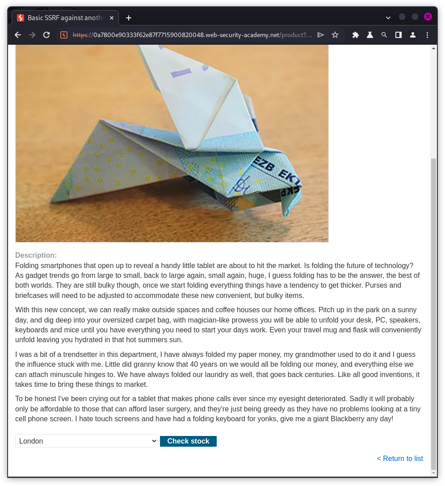

# Server Side Request Forgery in Detail
## What is Server Side Request Forgery?
SSRF, or Server-Side Request Forgery, is a web vulnerability where an attacker can make a server send requests to other resources on the internet, often within a trusted network. This can potentially lead to unauthorized access to internal systems, data exposure, or abuse of services.


## How Impactful are SSRF Attacks?
Server-Side Request Forgery (SSRF) attacks can have a significant and wide-ranging impact on the security and functionality of web applications and systems. The severity of the impact depends on various factors, including the vulnerability's context, the level of access gained, and the attacker's intent. 

Here are the potential impacts of SSRF attacks:
1. Data Exposure: SSRF can allow attackers to access sensitive internal data such as configuration files, credentials, and databases. This exposure can lead to data breaches and compromises in data integrity and confidentiality.
2. Remote Code Execution: In some cases, SSRF can be leveraged to execute code on the internal server or interact with internal services, potentially leading to complete compromise of the system.
3. Abusing Internal Services: Attackers can abuse SSRF to target and abuse internal services, potentially overloading them or causing disruptions in critical operations.
4. Exploiting Infrastructure: SSRF can be used to perform reconnaissance on internal network infrastructure, identifying vulnerabilities for future attacks.
5. Bypassing Security Controls: SSRF can be used to bypass security controls by making requests to trusted internal systems, making it challenging to detect and mitigate the attack.
6. Server Abuse and Anonymization: Attackers can abuse SSRF to make requests to external services from the server, effectively anonymizing their activities and potentially implicating the targeted server in malicious actions.
7. Attack Chaining: SSRF can be part of a larger attack chain, where it's used to initiate or facilitate further attacks, such as accessing internal services to gather information for subsequent attacks.

# Types of SSRF Attacks:
## 1. Common SSRF Attacks:
SSRF attacks happen when a sneaky hacker tricks a trusting website into doing things it shouldn't. The hacker uses this trust to go beyond the website and mess with other places, like secret parts of the internet or internal systems of a company, causing all sorts of trouble.

### SSRF Attacks Against the Server
In these types of attacks, the attacker causes the application to make an HTTP request back to the server that is hosting the application, via its loopback network interface.

*The loopback network interface is a special network interface on a computer that allows network communication to itself.*

**Example:** Imagine a shopping application that lets the user view whether an item is in stock in a particular store. To provide the information, the application must query its internal APIs. It does this by making another request to a relevant API endpoint through an HTTP request. A request similar to the following is made for carrying out this process:

```
POST /product/stock HTTP/1.0
Content-Type: application/x-www-form-urlencoded
Content-Length: xyz

stockApi=http://stock.shopwebsite.net:1711/product/stock/check%3FproductId%3D6%26storeId%3D1
```

Carefully look at the end of the stockApi line. It says `check%3FproductId%3D6%26storeId%3D1`, If you URL decode it, You can see it converts to `check?productId=6&storeId=1`. With this you can conclude that the stock at Store id 1 is being checked/retrieved for the product id 6.

Anyways, This causes the server to make request to the specified URL, then fetch and return the stock data.

In this example, An attacker can forge the request to specify a different URL than what was originally meant to be used. The modified HTTP request might look something like this: 

```
POST /product/stock HTTP/1.0
Content-Type: application/x-www-form-urlencoded
Content-Length: xyz

stockApi=http://localhost/admin
```

What happens here is that the data is fetched from the request and the URL to be fetched becomes `http://localhost/admin`. This causes the server to fetch data from `http://localhost/admin` and display it in result.

An attacker can visit `/admin` URL, but as the user is unauthenticated, the page won't be accessible. But when the same page is requested from within the server, the normal access controls are bypassed because the request appears to originate from a trusted location.

### [SSRF Lab 1 - Basic SSRF against the local server](https://portswigger.net/web-security/ssrf/lab-basic-ssrf-against-localhost)

Description of Lab:

```
This lab has a stock check feature which fetches data from an internal system.

To solve the lab, change the stock check URL to access the admin interface at http://localhost/admin and delete the user carlos.
```

1. Access the lab.


2. Let's first try visiting the `/admin` page.


As we can see that the webpage says `Admin interface only avaliable if logged in as an administrator, or if requested from loopback`.

3. Let's open any product's page and try checking the stock for the product.


4. 


5. Let's now find the request which fetches the stock for a product.


6. Now right click on the request and send to repeater. Repeater is what is used for editing requests.


7. Let's Now Replace the API Link.


8. Replace the fetching stock API link with the admin page link. And Submit the request.


9. And this is the response we get.


To open the response in a browser, right click on the response and select `Request in browser` > `In current browser session`. Then copy the link and open in the browser set up by burp.


10. On visiting the link and we can see that we successfully loaded the admin page.


11. Now let's try deleting the `carlos` account.


12. As we can see that the action is not allowed. 


13. Let's again edit the original request and check the response.


14. This time it responded with a `HTTP/2 302 FOUND` code.


15. As we can see the `Congratulations, you solved the lab!` message, we can conclude that we were successful at deleting `carlos` account.


### [SSRF Lab 2 - Basic SSRF against another back-end system](https://portswigger.net/web-security/ssrf/lab-basic-ssrf-against-backend-system)
Description of Lab:
```
This lab has a stock check feature which fetches data from an internal system.

To solve the lab, use the stock check functionality to scan the internal 192.168.0.X range for an admin interface on port 8080, then use it to delete the user carlos.
```

1. Access the lab.


2. Open any product's page.



3. Check the stock.


4. Look for the stock retrieval request in BurpSuite.


5. Send the request to repeater to tamper the request and test.


6. Let's now try editing the `stockApi` link in the request.


7. As we know from the description that the admin interface is at the server `192.168.0.x` at port `8080`. We need to try finding the `x`. Send the request to intruder.


8. Now in the Intruder tab, select the `1` in the `stockApi` link and press the Add button in the right side.


9. Now As the values can be anything from `1 to 255`, Let's copy the values `1 to 255` and go to the payloads tab. 
   ***Note:** What I've done here is echoed values from `1 to 255` and then used a tool **`xclip`** to copy the numbers to the clipboard by piping the output of loop into `xclip` command.*


10. Now paste the copied payloads using the paste button in `Payload settings [Simple list]` and then press the `start attack` button. 


11. Here you will see a request that stands out. This is how we get the value of `x`.


12. Now replace `x` with the payload and send the request with the URL which is used to delete an account.


13. Reloading the page, you can see the message `Congratulations, you solved the lab!`.


